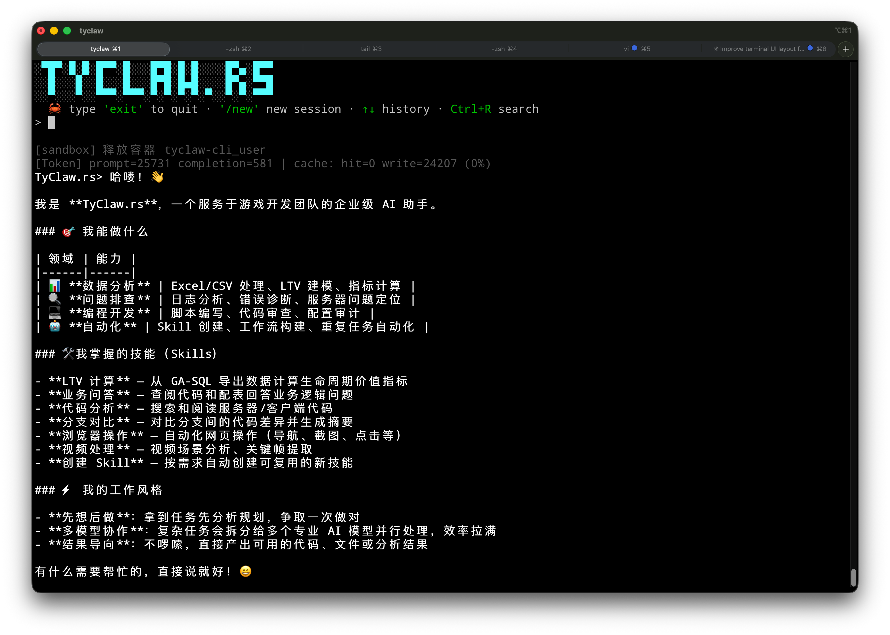

# TyClaw.rs

- 企业级多模型 AI Agent 系统，Rust 实现
- 面向游戏开发团队的数据分析、问题排查、视频分析，办公自动化场景
- 优秀的企业Agent基建底座，创建和沉淀Skill技能，实现企业内部AI工作流定制化
- 充分考虑成本（多模型配合）,安全（审计日志，安全配置，沙箱隔离）等痛点

## CLI 终端

分屏布局：Logo + 输入固定在顶部，agent 输出在下方滚动，互不干扰。



## 监控面板

内置轻量监控页面（`http://127.0.0.1:9394`），实时查看活跃任务、Skills、审计日志。


## 实机操作

下面是我实际使用的一些例子，通过钉钉聊天，做了分析广告视频，计算LTV等复杂任务，并且沉淀了可以复用的SKILL，如果再组合上企业内部系统的调用，可以极大提升工作效率...


## 技术特点

- **Rust 全栈** — 多 crate 模块化设计，类型安全，Tokio 异步运行时，per-session 串行 + 跨 session 并发
- **多模型混合编排** — 同一任务内按角色（coding / reasoning / search / review）路由到最擅长的模型，DAG 依赖感知并行调度
- **Workspace 架构** — 以用户（或群聊）为中心的持久化空间，md5 分桶存储，可配置 key 策略，支持个人助理和团队协作两种模式
- **Docker 沙箱隔离** — per-workspace 容器，volume mount 共享文件，资源限制（内存/CPU/进程数），工具操作在容器内安全执行
- **Prompt Cache** — 系统提示词静态/动态分段 + API 级缓存标记，多轮对话持续命中缓存，显著降低 token 消耗
- **提示词全外置** — 所有 LLM 提示词集中在 `prompts.yaml`，修改后重启生效，无需重新编译，支持快速 A/B 测试
- **审计追溯** — 全局按天 audit 审计日志 + history.jsonl 完整对话记录（含子 agent 的全部工具调用详情）
- **Session 自动回收** — 空闲超时自动 consolidate 对话到长期记忆、清理临时文件、销毁容器；token 超阈值时自动整理记忆并清空历史
- **Memory 智能过滤** — 注入上下文前按关键词相关性过滤 Memory 段落，减少噪音干扰；当前任务焦点自动追加到 context 末尾
- **浏览器自动化** — Docker 沙箱内置 Xvfb + Chromium + Playwright，支持非 Headless 浏览器操作（CDP 常驻会话，跨调用保持登录状态）
- **内置监控面板** — 轻量 HTTP 监控页面（`127.0.0.1:9394`），实时查看活跃任务、Skills、审计日志，自动刷新
- **ask_user 交互** — Agent 可在执行过程中暂停向用户提问，等待回复后从暂停处恢复；用户空回车则使用默认行为继续
- **Skill创建管理** — 支持企业 Skill 统一管理，用户可灵活自定义 Skill，方便企业组织能力沉淀
- **单二进制部署** — 小巧的单二进制可执行文件部署，还附带钉钉网关和独立 agent 命令行工具，符合企业业务场景

## 核心设计

### 多模型编排

主控 LLM 通过 `dispatch_subtasks` 工具将任务拆分为 DAG，交给专业模型并行执行：

```
主控 (GPT)
  |-- dispatch_subtasks
       |-- research (Gemini Pro)  -- 只读探索
       |-- coding (Claude Opus)   -- 代码实现 + 验证
       |-- review (GPT)           -- 独立审查
       \-- summarize (GPT)        -- 结果综合
```

- **node_type 路由**：coding → Claude Opus，search → Gemini Pro，reasoning → GPT，可自定义
- **依赖感知调度**：DAG 中声明依赖的节点串行，无依赖的并行
- **结果归并**：多个子任务输出通过 Reducer 综合为一个连贯回复
- **子 agent 操作审计**：每个子任务的工具调用记录完整保留在 history 中

### Workspace 架构

以 workspace 为中心的持久化空间，每个 workspace 对应一个用户或一个群聊（通过可配置策略决定）。

```
{run-dir}/
+-- config/                 全局配置
+-- skills/                 全局共享技能（只读）
+-- cases/                  全局共享案例
+-- audit/                  全局审计日志（按天分文件）
+-- logs/                   全局日志 + snapshot
|
+-- works/                  workspace 容器（md5 分桶）
    +-- {bucket}/{key}/     每个 workspace 的持久化空间
        +-- memory/         长期记忆（MEMORY.md / HISTORY.md）
        +-- skills/         私有技能
        +-- cases/          私有案例
        +-- timer_jobs.json 定时任务
        +-- history.jsonl   对话历史
        +-- work/           Docker 挂载点
            +-- attachments/
            +-- tmp/
            +-- dispatches/
```

**workspace key 策略**（config.yaml 配置）：
- `user_id` — 按用户隔离，个人数字助理模式
- `conversation` — 私聊跟人走，群聊跟群走

### Session 生命周期

Session 是 workspace 的活跃窗口，不是显式对象：
- 有请求访问 → 创建 session（生成 `s_YYYYMMDD_HHmmss_xxxx` ID）+ 启动 Docker 容器
- 持续活跃 → 复用容器，追加对话历史
- 历史膨胀 → token 超过上下文窗口 50% 时自动 consolidate 到 MEMORY.md，清空历史
- 空闲超时 → 回收：consolidate 对话 → 清理 tmp → 销毁容器
- 再次访问 → 新 session + 新容器，memory 和技能保留

### Prompt 缓存

系统提示词通过 `[[CACHE_BOUNDARY]]` 标记分为静态段和动态段：
- 静态段（Identity + Guidelines + Capabilities + Skills）→ API 级缓存
- 动态段（DateTime + Similar Cases）→ 每次请求重新构建
- 多轮对话中静态段持续命中缓存，节省 token

### 提示词外置

所有提示词集中在 `config/prompts.yaml`，修改后重启生效，无需重新编译：
- 主控 Identity / Guidelines / Execution Baseline
- 子 agent 角色提示词（coding / reasoning / search / review / ...）
- Nudge 催促文本（plan_required / idle_spin / ...）
- Planner / Reducer / Memory Consolidation 提示词

## 架构概览

```
                    +------------------+
                    |   tyclaw-app     |  CLI / DingTalk 入口
                    +--------+---------+
                             |
                    +--------+---------+
                    | tyclaw-channel   |  多通道适配（CLI / 钉钉 Stream）
                    +--------+---------+
                             |
              +--------------+--------------+
              |    tyclaw-orchestration     |  核心编排层
              |  +-----------------------+  |
              |  | Orchestrator          |  |  请求处理、会话管理、权限
              |  | SessionManager        |  |  workspace 级会话持久化
              |  | SkillManager          |  |  全局 + workspace 技能合并
              |  | SubtasksEngine        |  |  多模型 DAG 调度
              |  |   DagScheduler        |  |  依赖感知的并行调度
              |  |   Executor            |  |  per-node 子 agent 执行
              |  |   Reducer             |  |  多输出归并
              |  +-----------------------+  |
              +-+-------+-------+-------+--+
                |       |       |       |
    +-----------+  +----+----+  |  +----+----------+
    |tyclaw-agent| |tyclaw-  |  |  |tyclaw-prompt  |
    | AgentLoop  | |provider |  |  | ContextBuilder|
    | ReAct 循环 | |LLM 适配 |  |  | prompts.yaml  |
    +------------+ +---------+  |  +---------------+
                                |
                 +-----------+--+-----------+--------------+
                 |           |              |              |
            +----+----+   +--+---------+   ++--------+   +-+-----------+
            |tools    |   |memory      |   |control  |   | sandbox     |
            |文件/搜索|   |案例/记忆   |   |RBAC/审计|   |Docker 隔离  |
            |exec/定时|   |consolidator|   |限流     |   |per-workspace|
            +---------+   +------------+   +---------+   +-------------+
```

### Crate 一览

```
tyclaw-types          基础类型、错误、token 估算
tyclaw-tool-abi       工具 trait 定义（Tool / Sandbox / SandboxPool）
tyclaw-provider       LLM 适配层（OpenAI 兼容 API + prompt cache）
tyclaw-prompt         上下文构建 + prompts.yaml 加载
tyclaw-tools          内置工具（文件/搜索/exec/定时器/web）
tyclaw-control        RBAC / 审计 / 限流 / WorkspaceManager
tyclaw-memory         案例库 / 记忆存储 / consolidator / 检索
tyclaw-sandbox        Docker 沙箱（per-workspace 容器池）
tyclaw-agent          AgentLoop（ReAct 循环 + 阶段控制）
tyclaw-orchestration  编排层（Orchestrator / DAG 调度 / Session）
tyclaw-channel        通道适配（CLI REPL / 钉钉 Stream）
tyclaw-app            应用入口可执行文件（命令行参数 / 启动流程）
tyclaw-client         轻量 CLI 客户端，类似cursor_cli的独立可执行文件
dingtalk-gateway      钉钉消息网关（独立部署，会话亲和分发）
```

## 快速开始

### 1. 安装前置依赖

- **Rust 工具链**：`rustup` + stable toolchain
- **Docker**：用于沙箱隔离执行（可选，不装则回退宿主机直接执行）

### 2. 构建 Docker 沙箱镜像

```bash
docker build -t tyclaw-sandbox:latest docker/sandbox/
```

镜像基于 `python:3.11-slim`，预装以下工具和库：

| 类别 | 内容 |
|------|------|
| 系统工具 | ripgrep, ffmpeg, tesseract-ocr (中英文), Node.js 22, Rust |
| Python 库 | pandas, numpy, openpyxl, requests, opencv-python-headless, av, pytesseract, faster-whisper, scenedetect |
| 浏览器 | Xvfb + Chromium + Playwright + playwright-stealth（非 Headless 渲染，反检测） |

容器通过 `entrypoint.sh` 启动 Xvfb 虚拟屏幕后 `sleep infinity`，作为容器池等待 `docker exec` 调用。

### 3. 配置

```bash
cp workspace/config/config.example.yaml workspace/config/config.yaml
# 编辑 config.yaml，填入 API key 和钉钉凭证
```

### 4. 使用 start.sh 启动

项目提供了 `start.sh` 脚本，封装了常用的启动方式：

```bash
# 直接启动（保留上次运行状态）
./start.sh

# 清理运行时数据后启动（保留 memory）
./start.sh --clean

# 重新构建 sandbox Docker 镜像（并回收旧容器）
./start.sh --build-docker

# 启动并连接钉钉
./start.sh --dingtalk

# 组合使用：先清理再以钉钉模式启动
./start.sh --clean --dingtalk

# 重建镜像 + 清理 + 钉钉模式
./start.sh --build-docker --clean --dingtalk
```

**参数说明：**

| 参数 | 说明 |
|------|------|
| （无参数） | 直接启动，保留上次所有运行时状态 |
| `--clean` | 启动前清理运行时数据（见下方详细说明） |
| `--build-docker` | 重新构建 sandbox Docker 镜像并回收旧容器 |
| `--dingtalk` | 启动后连接钉钉 Stream，进入钉钉 + CLI 混合模式 |
| 其他参数 | 透传给 `tyclaw-app`（如 `--works-dir /data/works`） |

**`--clean` 清理范围：**

| 操作 | 说明 |
|------|------|
| 终止 tyclaw 进程 | `killall -9 tyclaw` |
| 清空日志 | `workspace/logs/tyclaw.log` |
| 清空 workspace 临时数据 | 每个 workspace 下的 `history.jsonl`、`timer_jobs.json`、`skills/`、`cases/`、`work/`（**memory/ 保留**）|
| 清空审计日志和全局案例 | `workspace/audit/`、`workspace/cases/` |
| 清空临时文件 | `workspace/tmp/`、`workspace/dispatches/`、`.dispatch-*`、`.active_tasks.json` |
| 清理 Docker 容器 | 删除所有 `tyclaw-` 前缀的容器 |
| 清空系统临时文件 | `/tmp/tyclaw_*`、`/tmp/_tyclaw_inline_*` |
| 复制 demo 数据 | 将 `demo/` 下的示例文件复制到 `cli_user` workspace |

> **注意**：`--clean` 会保留每个 workspace 的 `memory/` 目录（长期记忆），不会丢失积累的上下文。

### 5. 手动启动（不使用 start.sh）

也可以直接通过 cargo 启动：

```bash
# CLI 模式
cargo run -p tyclaw-app -- --run-dir workspace

# 钉钉 + CLI 混合模式
cargo run -p tyclaw-app -- --run-dir workspace --dingtalk

# 指定外挂 works 目录（兼容老数据）
cargo run -p tyclaw-app -- --run-dir workspace --works-dir /data/works
```

### 6. 全量编译

```bash
cargo build --release

# 产物
target/release/tyclaw              # 主程序（CLI + 钉钉）
target/release/tyclaw-client       # 独立 CLI 客户端
target/release/dingtalk-gateway    # 钉钉消息网关
```

### 无 Docker 模式（本地快速测试）

> **WARNING: 无 Docker 模式下所有工具命令（文件操作、代码执行、shell 命令等）将直接在宿主机上运行，没有任何沙箱隔离和资源限制。恶意或失控的 prompt 可能导致宿主机文件被删除、系统被破坏。线上环境 / 生产部署严禁使用此模式！仅限本地开发测试！**

只需确保 Docker daemon 未运行，TyClaw 启动时会自动检测并回退到宿主机直接执行：

```bash
# 1. 停掉 Docker（macOS colima 用户）
colima stop
# 如果卡住：colima stop --force

# 2. 确认 Docker 已关闭（应报错 "Cannot connect to the Docker daemon"）
docker info

# 3. 直接启动，跳过步骤 2 的 Docker 镜像构建
./start.sh

# 启动日志中会出现以下警告，说明已进入无沙箱模式：
# WARN Docker not available — tool commands will run directly on host WITHOUT sandbox isolation
```

无需修改任何配置文件，无需构建 Docker 镜像，也不需要安装 Python 及相关依赖（但宿主机上缺少的工具将无法使用）。

## Docker 沙箱

### 容器资源限制

| 参数 | 默认值 | 说明 |
|------|--------|------|
| image | `tyclaw-sandbox:latest` | 沙箱镜像 |
| memory | `1g` | 内存上限（Chromium 非 Headless 需要较多内存） |
| cpus | `1` | CPU 核数 |
| network | `bridge` | 网络模式 |
| work_dir | `/workspace` | 容器内工作目录 |
| pids-limit | `512` | 最大进程数（Chromium 需要较多子进程） |
| shm-size | `256m` | 共享内存（Chromium IPC 需要） |

### 挂载关系

```
宿主机: works/{bucket}/{workspace_key}/  -->  容器: /workspace/
                                              +-- work/        (工作目录, -w)
                                              +-- skills/      (私有技能)
                                              +-- memory/      (记忆)
                                              +-- cases/       (案例)
宿主机: workspace/skills/                -->  容器: /workspace/skills/  (只读)
宿主机: workspace/tools/                 -->  容器: /workspace/tools/   (只读)
```

## 钉钉接入

支持两种连接模式：

### 直连模式（默认）

```
钉钉服务器 <--WebSocket--> TyClaw (DingTalkStreamClient)
```

### Gateway 模式

```
钉钉服务器 <--WebSocket--> dingtalk-gateway <--WebSocket--> TyClaw (GatewayClient)
```

配置 `config.yaml` 增加 `gateway_url: "ws://gateway-host:9100"` 即可切换。

Gateway 模式适用于多实例部署、网络隔离、高可用场景。

### 消息处理流程

```
用户 @bot 发消息
  → 钉钉 Stream / Gateway 推送
  → DingTalkBot 解析（文本/图片/附件）
  → InboundMessage 推入 MessageBus
  → Orchestrator 处理（per-workspace 串行）
  → 回复通过钉钉主动消息 API 发出
```

## 独立 CLI 客户端

`tyclaw-client` 单次执行一个 prompt 后退出，适合脚本集成：

```bash
cargo build -p tyclaw-client --release
tyclaw-client -w workspace "帮我分析一下这段日志"
```

| | tyclaw-app | tyclaw-client |
|---|---|---|
| 模式 | 交互式 REPL / 钉钉长连接 | 单次执行后退出 |
| Docker 沙箱 | 支持 | 不支持 |
| 适用场景 | 生产部署 | 脚本集成 / 快速测试 |

## DingTalk Gateway

独立部署的钉钉消息网关，维护多条到钉钉服务器的 WebSocket 连接，按会话亲和分发。

```bash
cargo build -p dingtalk-gateway --release
cp crates/dingtalk-gateway/config.example.yaml crates/dingtalk-gateway/config.yaml
# 编辑 config.yaml 填入钉钉凭证
target/release/dingtalk-gateway
```

不依赖任何 `tyclaw-*` crate，独立编译为 ~2.4MB 二进制。详见 `crates/dingtalk-gateway/README.md`。

## 配置参考

`workspace/config/config.yaml`（详见 `config.example.yaml`）：

```yaml
# 所有模型统一定义，每个可自由选择直连或代理
providers:
  gpt:
    endpoint: "https://api.openai.com/v1"      # 直连
    api_key: "sk-..."
    model: "gpt-5.4"
  claude-opus:
    endpoint: "https://relay.tuyoo.com/v1"      # 代理
    api_key: "YOUR_RELAY_KEY"
    model: "openai/claude-opus-4.6"
    thinking_enabled: true
    thinking_effort: "high"
  gemini-pro:
    endpoint: "https://relay.tuyoo.com/v1"
    api_key: "YOUR_RELAY_KEY"
    model: "openai/gemini-3.1-pro-preview"

# 主控 LLM —— 引用 provider 名字
llm:
  provider: "gpt"
  max_iterations: 99
  context_window_tokens: 200000

# 子任务 —— 路由到不同 provider
subtasks:
  enabled: true
  planner_model: "gpt"
  reducer_model: "gpt"
  default_model: "gpt"
  routing_rules:
    - node_type_pattern: "coding*"
      target_model: "claude-opus"
    - node_type_pattern: "search"
      target_model: "gemini-pro"

workspace:
  key_strategy: "user_id"       # user_id | conversation
  idle_timeout_secs: 1800       # 空闲 30 分钟后回收（0 = 不回收）
```

**配置优先级**：命令行参数 > 环境变量 > `providers[name]` > `llm` 内联字段 > 默认值

**workspace 配置说明**：

| 参数 | 默认值 | 说明 |
|------|--------|------|
| `key_strategy` | `user_id` | `user_id`：按用户隔离（个人助理）；`conversation`：私聊跟人走，群聊跟群走 |
| `idle_timeout_secs` | `1800` | workspace 空闲超时秒数。超时后自动 consolidate 对话到 memory、清理临时文件、销毁 Docker 容器。设为 0 禁用回收 |

`workspace/config/prompts.yaml`：所有 LLM 提示词，中文，修改后重启生效。
